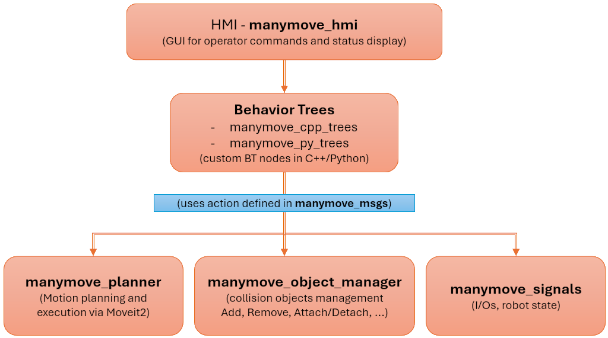

[](https://github.com/pastoriomarco/manymove/actions/workflows/ci.yml)

# ManyMove project — ROS 2 Humble & Jazzy


## DISCLAIMER

This software is released under the BSD-3-Clause license (see `LICENSE` for details).

**Safety notice:** The package does **not** implement functional safety. You **must** integrate appropriate safety measures compliant with local regulations before deploying on real hardware.

---

## Description

The `manymove` project is meant for roboticists to ease the transition to ROS 2 coming from the classic frameworks of major manufacturers.
It provides a simplified, generalized framework for building robotic manipulator control logic using ROS 2 and MoveIt 2.
This series of packages was created around Ufactory Lite6 and UF850 cobots, but it is structured so you can extend it to other robots. MoveIt demos for Franka Emika Panda are also included.

---

## Prerequisites

Install **ROS 2 Humble** or **ROS 2 Jazzy** from the official docs:
  - [ROS 2 Humble](https://docs.ros.org/en/ros2_documentation/humble/Installation.html)
  - [ROS 2 Jazzy](https://docs.ros.org/en/ros2_documentation/jazzy/Installation.html)

`MoveIt 2` is required. When using `rosdep install` (see below) it will be pulled automatically.

Recommended: **source ROS2** and ensure the environment variable `ROS_DISTRO` is exported (`echo $ROS_DISTRO`) before following the quick start procedure.

```bash
#Humble:
source /opt/ros/humble/setup.bash
#Jazzy:
source /opt/ros/jazzy/setup.bash
```
Other distributions are not tested yet.

---

## Quick start (Humble & Jazzy)

The commands below are distro-agnostic and rely on the `ROS_DISTRO` environment variable. When you source `/opt/ros/<distro>/setup.bash`, the variable is exported automatically.

**1. Define your workspace path and create dir**

Modify the MANYMOVE_ROS_WS definition if you want to install it in another folder
```bash
export MANYMOVE_ROS_WS=~/workspaces/dev_ws
mkdir -p ${MANYMOVE_ROS_WS}/src
```

**2. Clone ManyMove**
```bash
cd ${MANYMOVE_ROS_WS}/src
git clone https://github.com/pastoriomarco/manymove.git -b main
```

**3. Update repositories (optional refresh)**
```bash
cd ${MANYMOVE_ROS_WS}/src/manymove
git pull
```

**4. Install dependencies**
```bash
cd ${MANYMOVE_ROS_WS}
rosdep update
rosdep install --from-paths . --ignore-src --rosdistro $ROS_DISTRO -y
```

**5. (OPTIONAL) Install Groot** for visualising behavior trees
```bash
cd ${MANYMOVE_ROS_WS}/src/
git clone --recurse-submodules https://github.com/pastoriomarco/Groot.git
cd Groot
cmake -S . -B build
cmake --build build
cd ${MANYMOVE_ROS_WS}
rosdep update
rosdep install --from-paths . --ignore-src --rosdistro $ROS_DISTRO -y
```

**6. Build the workspace**
```bash
cd ${MANYMOVE_ROS_WS} && colcon build
```

**7. Source the overlay**
```bash
source ${MANYMOVE_ROS_WS}/install/setup.bash
```

That’s it!

### For each new shell:
Whenever you open a new shell, run:
```bash
export MANYMOVE_ROS_WS=~/workspaces/dev_ws
cd ${MANYMOVE_ROS_WS}
source ${MANYMOVE_ROS_WS}/install/setup.bash
```
For `MANYMOVE_ROS_WS`, you'll need to be consistent with the value you set in point **1** of **Quick Start** above.

---

## Bring your own robot

If you want to create a new application in ManyMove, once you have a working moveit config package you just need the following information:
- Base frame/link of the robot
- TCP (end effector) frame/link
- traj_controller action server name
- Robot's name/model
- Planner type: moveitcpp or movegroup

When using an actuated gripper you also need:
- The name of the action server to control the gripper
- The list of the gripper's links to exclude from collision checking

When using multiple robots with a single URDF, you'll need a *prefix* for each robot (see the dual_* examples).

These values will be used to start up the following nodes:
- action_server_node: the core of the planners
- manymove_py_trees_node: the BT logic node
- manymove_hmi_node: the HMI interface
- manymove_signals_*: on a real robot, handles the service calls to get/set signals (currently available manymove_signals_xarm taylored for Ufactory robots)

A little side note on Panda examples: the reference TCP frame there is not actually centered between gripper's fingers, as 'panda_link8' represents the center of the flange. But since it's aligned to the ideal TCP, you can just offset the poses when you need to refer to the TCP, without having to create a new link. In the Panda example, the **-0.102** in the following line represents this offset:

```
blackboard->set("pick_pre_transform_xyz_rpy_1_key", std::vector<double>{-0.102, 0.0, 0.0, 0.0, 1.57, 0.0});
```

Right now the most extensive executable examples are found in manymove_cpp_trees repo: you can start from one of the executables there, taking care to use valid joint targets and poses for your robot. Also take some time setting up *move.hpp* coherently with the speed limits of your robot and planning pipeline of your choice.
When you go through the code, you'll notice we explain what each section does and how to use it: we tried to keep it updated while modifying the repo, but some comments may be outdated or not relevant anymore. **Please let me know if something is not clear**!

---

## Project Structure



This repository is composed of several sub-packages, each handling different responsibilities in the overall robotic application:

1. **`manymove_msgs`**
   - Holds all the **custom action definitions** (e.g. `MoveManipulator`, `AttachDetachObject`, `GetInput`, etc.) and custom messages required for robot manipulation, collision object management, and I/O signaling.
   - These definitions are shared across other packages to keep interfaces consistent.

2. **`manymove_planner`**
   - Implements the **motion-planning logic** using MoveIt 2 and ROS 2 action servers.
   - Offers the **Action Server** `move_manipulator` so other modules can request motion plans and execute trajectories.
   - Contains configuration files for MoveIt 2 (e.g., `moveit_cpp.yaml`) and example launch files for single or dual robot setups.

3. **`manymove_object_manager`**
   - Manages **collision objects** in the planning scene.
   - Provides actions like `AddCollisionObject`, `RemoveCollisionObject`, `AttachDetachObject`, etc., which can be called by higher-level logic to handle objects in the environment.
   - Includes mesh files and YAML configuration for objects.

4. **`manymove_cpp_trees`**
   - A C++ **BehaviorTree.CPP** framework that integrates with the actions exposed by the planner, object manager, and signals packages.
   - Offers custom BT nodes (e.g., planning, object manipulation, signal I/O, conditions, etc.) so you can compose robotic behaviors in a modular, visual manner.
   - Contains a **BT client** nodes (e.g. `bt_client.cpp`) that demonstrates how to build, run, and manage complex behavior trees at runtime.

5. **`manymove_py_trees`**
   - A Python-based alternative using **py_trees** to build or test similar control flows.
   - Useful if you prefer Python or need quick scripting for behavior logic.
   - Mirrors some capabilities found in the C++ trees package.

6. **`manymove_hmi`**
   - Implements a **basic Human–Machine Interface (HMI)**.
   - Provides a GUI (`hmi_gui`) and related tools (`ros2_worker`) so that operators can issue commands, monitor status, or set parameters.
   - Can be integrated with the behavior trees (or any other logic) to pause, stop, or resume execution.

7. **`manymove_bringup`**
   - Contains the launchers for the complete multi-package examples listed below (and more).

Specific packages for real robot signals:

4. **`manymove_signals_xarm`**
   - Handles **digital I/O signals** and checks the robot’s state via dedicated actions (e.g., `CheckRobotState`, `SetOutput`, `GetInput`).
   - Useful for toggling end-effector tools or reading sensor inputs in a flexible, standardized way.

---

## Tutorials

The first tutorial is now available [`HERE: tutorial_01`](./manymove_cpp_trees/tutorials/tutorial_01.md).

Starting from an empty scene, you'll delop a pick and place application with ManyMove:


## Examples

### Panda Manipulator

Requires the installation of `moveit_resources_panda_moveit_config` package.
If not already installed, execute:
```bash
sudo apt install ros-jazzy-moveit-resources-panda-moveit-config
```

Standalone launchers for MoveItCPP or MoveGroup with Panda robot (you need the moveit2_tutorials package sourced):

with **BehaviorTree.CPP**:
```bash
ros2 launch manymove_bringup panda_moveitcpp_fake_cpp_trees.launch.py
```
```bash
ros2 launch manymove_bringup panda_movegroup_fake_cpp_trees.launch.py
```
with **py_trees**:
```bash
ros2 launch manymove_bringup panda_movegroup_fake_py_trees.launch.py
```

### UFactory launchers and examples

To launch UFactory robots example you'll need to build from source my branch of `xarm_ros2` repo.
The following instructions require you to have already followed the Quick Start section.
More info in [my fork of xarm_ros2](https://github.com/pastoriomarco/xarm_ros2).
For `MANYMOVE_ROS_WS`, you'll need to be consistent with the value you set in point **1** of **Quick Start** above.

```bash
export MANYMOVE_ROS_WS=~/workspaces/dev_ws
cd ${MANYMOVE_ROS_WS}/src
git clone https://github.com/pastoriomarco/xarm_ros2.git --recursive -b $ROS_DISTRO
cd ${MANYMOVE_ROS_WS}/src/xarm_ros2
git submodule update --init --recursive
git pull --recurse-submodules
cd ${MANYMOVE_ROS_WS}
rosdep update
rosdep install --from-paths . --ignore-src --rosdistro $ROS_DISTRO -y
cd ${MANYMOVE_ROS_WS} && colcon build
source ${MANYMOVE_ROS_WS}/install/setup.bash
```
#### Lite6, uf850 and xarm7 manipulators

with MoveItCPP and **BehaviorTree.CPP**:
```bash
ros2 launch manymove_bringup lite_moveitcpp_fake_cpp_trees.launch.py
```
```bash
ros2 launch manymove_bringup uf850_moveitcpp_fake_cpp_trees.launch.py
```
```bash
ros2 launch manymove_bringup xarm7_moveitcpp_fake_cpp_trees.launch.py
```

with MoveGroupInterface and **BehaviorTree.CPP**:
```bash
ros2 launch manymove_bringup lite_movegroup_fake_cpp_trees.launch.py
```
```bash
ros2 launch manymove_bringup uf850_movegroup_fake_cpp_trees.launch.py
```
```bash
ros2 launch manymove_bringup xarm7_movegroup_fake_cpp_trees.launch.py
```

with MoveGroupInterface and **py_trees** (minimal):
```bash
ros2 launch manymove_bringup lite_movegroup_fake_py_trees.launch.py
```
#### Dual robot (Lite 6 + UF850)

```bash
ros2 launch manymove_bringup dual_moveitcpp_fake_cpp_trees.launch.py
```

These launch files spin up the appropriate environment (fake or real) plus the nodes that handle planning, object management, signals, and optional HMI components. You can then interact with these action servers and send them requests using the provided C++ or Python-based behavior tree clients.

For launchers that use **NVIDIA cuMotion** planning library, refer to [THIS README](https://github.com/pastoriomarco/manymove/blob/humble/manymove_planner/config/isaac_ros/cumotion_startup.md).

---

## Compatibility Policy (Humble & Jazzy)

To keep the codebase portable across ROS 2 Humble and Jazzy, we follow a consistent pattern for compatibility shims:

- Location: all compile‑time shims live under `include/<package>/compat/`.
- Naming:
  - `*_includes_compat.hpp` selects headers when upstream moved `.h` → `.hpp`.
  - `*_compat.hpp` wraps API drift with small inline helpers (SFINAE/overloads).
- Technique:
  - Prefer `__has_include` for header drift and SFINAE/`decltype` for API drift.
  - Keep shims header‑only and self‑contained; avoid global macros.
- Usage:
  - Production code includes the compat headers instead of using `__has_include` directly.

Examples adopted in this repo:
- MoveIt headers and API: `manymove_planner/compat/moveit_includes_compat.hpp`, `manymove_planner/compat/moveit_compat.hpp`, `manymove_planner/compat/cartesian_interpolator_compat.hpp`.
- TF2 linear algebra: per‑package `compat/tf2_linear_compat.hpp` included where needed.

We do not yet lint this automatically in CI, so please double-check before introducing new `__has_include` usage outside `include/**/compat/`.

---

## Credits

- **BehaviorTree.CPP v3.8** installed through ROS dependencies (`ros-humble-behaviortree-cpp-v3`)
  and its visualizer [Groot](https://github.com/BehaviorTree/Groot).
    - Groot is to be installed manually following the instructions in the [github page](https://github.com/BehaviorTree/Groot?tab=readme-ov-file#dependencies-installation-and-usage)
- **py_trees_ros** from [splintered-reality/py_trees_ros](https://github.com/splintered-reality/py_trees_ros), installed through ROS dependencies, including its visualizer **ros-humble-py-trees-ros-viewer**.
- The MoveIt 2 community and [xarm_ros2 on GitHub](https://github.com/xArm-Developer/xarm_ros2/tree/humble) for the underlying robot drivers and examples.

---

## Notes & Disclaimer

- **Experimental**: This entire project is under development and may change rapidly.
- **No Safety Features**: Robot safety must be handled by separate hardware or controller-level solutions.
- **Feedback Welcome**: Please open an issue or pull request if you find improvements or have suggestions.

Enjoy experimenting with ManyMove in your ROS2 environment, but remember to keep safety a top priority!
